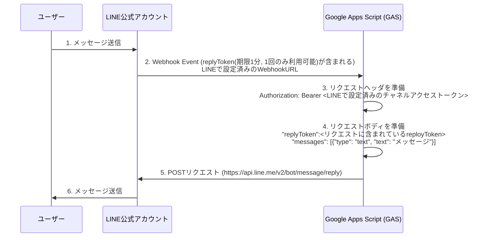

# 応答メッセージとは
ユーザーからのメッセージを作成したLINE公式アカウントで受けて、自動で返信する
Messaging APIを利用することでLINE Platformとデータをやりとりすることができる

ドキュメント: https://developers.line.biz/ja/docs/messaging-api/overview/#how-messaging-api-works

## シーケンス図

